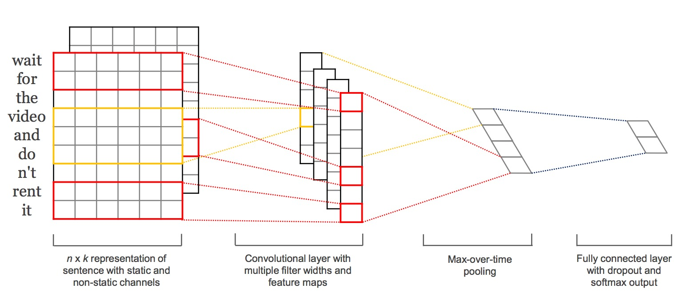

## DMLC

<a href='https://github.com/dmlc'></a>


---
## MXNet

- **M** : `mix`, 混合符号编程(symbolic programming)和命令式编程(imperative programming)

- **X**: `maximize`, 特制效率的提升

---
## MXNet

- 高效，支持多核并行

- 可移植，目前有R,Python,Julia,Matlab和Scala等接口。可在单机，集群甚至手机端运行

- 可扩展，支持单机多卡和多机并行


--- 
## MXNet系统组成

- 数据结构: `mxnet.NDArray`

- 网络定义: `mxnet.symbol` **核心接口**

- 数据传输: `mxnet.io`

- 优化器: `mxnet.optimize`

- 模型接口: 模型的载入，存贮以及fine-tune等


-----
## mxnet.NDArray

MXNet的基础数据结构，类似于numpy的array结构。**存贮和计算均支持CPU和GPU的切换**，并且有**惰性求值**的功能。

```{r eval=FALSE}
import mxnet as mx
a = mx.nd.ones((20000, 30000), mx.gpu()) # 存贮在GPU上
b = mx.nd.ones((30000, 20000), mx.gpu())
d = mx.nd.dot(a, b) 
# 至此a,b,d都只是符号链接，并没真正赋值
d.asnumpy() # run
```

其他常用诸多操作于都跟numpy类似，学习成本较低。


-----
## mxnet.symbol
系统的核心接口，用于定义神经网络的结构，语法简单，**自动检测数据纬度**。


[图像识别的常用CNN网络，AlexNet, GoogleNet, VGG,Inception等均有实现](https://github.com/dmlc/mxnet/tree/master/example/image-classification)。


-----
## 纬度推断

```python
data = mx.symbol.Variable('data')
fc1  = mx.symbol.FullyConnected(data = data, name='fc1', num_hidden=128)
act1 = mx.symbol.Activation(data = fc1, name='relu1', act_type="relu")
fc2  = mx.symbol.FullyConnected(data = act1, name = 'fc2', num_hidden = 64)
mlp  = mx.symbol.SoftmaxOutput(data = fc2, name = 'softmax')
```

``` python
arg_shape, out_shape, aux_shape = mlp.infer_shape(data=(100, 100))

>>> dict(zip(mlp.list_arguments(), arg_shape)) # 每层参数纬度
{'data': (100L, 100L), 
 'fc1_weight': (128L, 100L), 'fc1_bias': (128L,)
 'fc2_weight': (64L, 128L), 'fc2_bias': (64L,), 
 'softmax_label': (100L,),}
>>> out_shape # 输出结果纬度
[(100L, 64L)]
```

-----
## 用于文本分类的卷积网络

[Convolutional Neural Networks for Sentence Classification](http://arxiv.org/pdf/1408.5882v2.pdf)


-----
## 用于文本分类的卷积网络

## TOADD


---
## mxnet.io

常用IO接口:

- `NDArrayIter`: 用于常规的array数据

- `CSVIter`: 用于csv文件

- `ImageRecordIter`: 用于图片文件

节省数据处理时间，如shuffle和定义batch_size等操作。

----
## NDArrayIter

```{r eval=FALSE}
train_data = {'data': np.array(), 'label': np.array()}
test_data = {'data': np.array(), 'label': np.array()}

train_iter = mx.io.NDArrayIter(train_data['data'].reshape([17000, 1, 200, 200]),
                               train_data['label'], batch_size=50, shuffle = True)
test_iter = mx.io.NDArrayIter(test_data['data'].reshape([3000, 1, 200, 200]),
                              test_data['label'], batch_size=100, shuffle = True)
```


----
## ImageRecordIter
`im2rec` 工具，将图片和标签打包成单文件，节省磁盘空间并有利于数据读取。


```sh
./im2rec image.lst image_dir image.bin resize=256 # image.lst 图片文件列表
```

```{r eval=FALSE}
img_lst_path = '/User/yaleI/alphawolf_data/img/img.rec'
dataiter = mx.io.ImageRecordIter(path_imgrec=img_lst_path,
                                 batch_size=128,
                                 preprocess_threads=4, 
                                 data_shape=(3, 250, 370), # 切割图片
                                 shuffle=True,             # 随机打散
                                 rand_crop=True,           # 随机切割部分像素
                                 rand_mirror=True,         # 随机翻转
                                 mean_img="data/cifar/cifar10_mean.bin",
                                 )
```


可根据基础类`io.DataIter`自定义IO类。

---
## mxnet.optimizer


---
## mxnet.model

网络结构和数据准备好后，开始训练

``` python
model = mx.model.FeedForward.create(
     symbol = mlp,
     num_epoch=num_epoch,
     learning_rate=0.01)
model.fit()
```

---
## mxnet.model

``` python
prefix = 'mymodel'
iteration = 100
# 保存*.parameter(参数值) 和＊json(网络图) 两个文件
model.save(prefix, iteration) 

# 加载已有模型
model_loaded = mx.model.FeedForward.load(prefix, iteration)

# fine-tune
model_loaded.fit(***) 
```

--------
## 案例分享


---------
## More Resource

- [Inception-BN Network on ILSVRC2012 ](https://github.com/dmlc/mxnet-model-gallery/blob/master/imagenet-1k-inception-bn.md)

- [Inception-V3 Network on ILSVRC2012](https://github.com/dmlc/mxnet-model-gallery/blob/master/imagenet-1k-inception-v3.md)

- [Inception-BN Network on Full ImageNet Network](https://github.com/dmlc/mxnet-model-gallery/tree/master/imagenet-21k-inception)


----------
## Yelp Classification

[Yelp Restaurant Photo Classification
](https://www.kaggle.com/c/yelp-restaurant-photo-classification)

- [No.1 Solution](http://blog.kaggle.com/2016/04/28/yelp-restaurant-photo-classification-winners-interview-1st-place-dmitrii-tsybulevskii/): 使用了三个Pre-trained Model生成组合feature，再用多种分类模型组合投票

- [No.4 Solution](https://github.com/bzshang/yelp-photo-classification): 在Inception-V3 Network基础上进行Fine-tune，然后使用SVM，RF等模型组合做预测


---
## README MORE

- []

- [mxnet VS caffe](http://www.zhihu.com/question/36086842)


