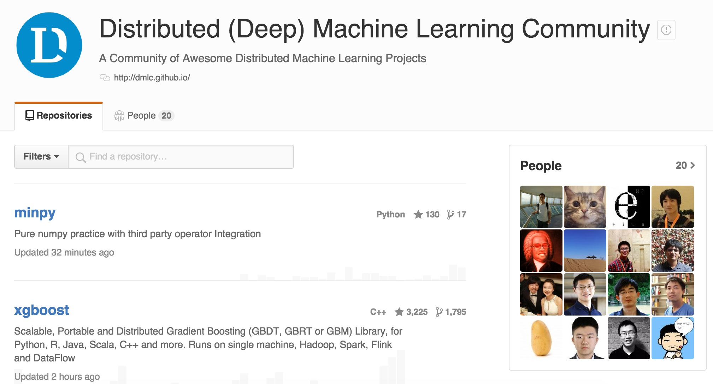

## DMLC

<a href='https://github.com/dmlc'></a>


---
## MXNet

- **M** : `mix`, 混合符号编程(symbolic programming)和命令式编程(imperative programming)

- **X**: `maximize`, 特制效率的提升

---
## MXNet

- 高效，支持多核并行

- 可移植，目前有R,Python,Julia,Matlab和Scala等接口。可在单机，集群甚至手机端运行

- 可扩展，支持单机多卡和多机并行


--- 
## MXNet系统组成

- 数据结构: `mxnet.NDArray`

- 网络定义: `mxnet.symbol` **核心接口**

- 优化器: `mxnet.optimize`

- 数据传输: `mxnet.io`

- 其他:
  - 模型接口: 模型的载入，存贮以及fine-tune等
  - kvstore: 设备间的数据交互


-----
## mxnet.NDArray

MXNet的基础数据结构，类似于numpy的array结构。**支持CPU和GPU**，并有**自动求导**的功能。


---
## mxnet.io

常用IO接口:

- NDArrayIter: 用于常规的array数据

- CSVIter: 用于csv文件

- ImageRecordIter: 用于图片文件

节省数据处理时间，如shuffle和定义batch_size等操作。

----
## NDArrayIter


```r
train_data = {'data': np.array(), 'label': np.array()}
test_data = {'data': np.array(), 'label': np.array()}

train_iter = mx.io.NDArrayIter(train_data['data'].reshape([17000, 1, 200, 200]),
                               train_data['label'], batch_size=50, shuffle = True)
test_iter = mx.io.NDArrayIter(test_data['data'].reshape([3000, 1, 200, 200]),
                              test_data['label'], batch_size=100, shuffle = True)
```


--
## ImageRecordIter
`im2rec` 工具，将图片和标签打包成单文件，节省磁盘空间并有利于数据读取。


```r
img_lst_path = '/User/yaleI/alphawolf_data/img/img.rec'
dataiter = mx.io.ImageRecordIter(path_imgrec=img_lst_path,
                                 batch_size=128,
                                 preprocess_threads=4, 
                                 data_shape=(3, 250, 370), # 切割图片
                                 shuffle=True,             # 随机打散
                                 rand_crop=True,           # 随机切割部分像素
                                 rand_mirror=True,         # 随机翻转
                                 mean_img="data/cifar/cifar10_mean.bin",
                                 )
```


可根据基础类`io.DataIter`自定义IO类。


--- .class #id 

## Slide 2


---
## README MORE


- [mxnet VS caffe](http://www.zhihu.com/question/36086842)


